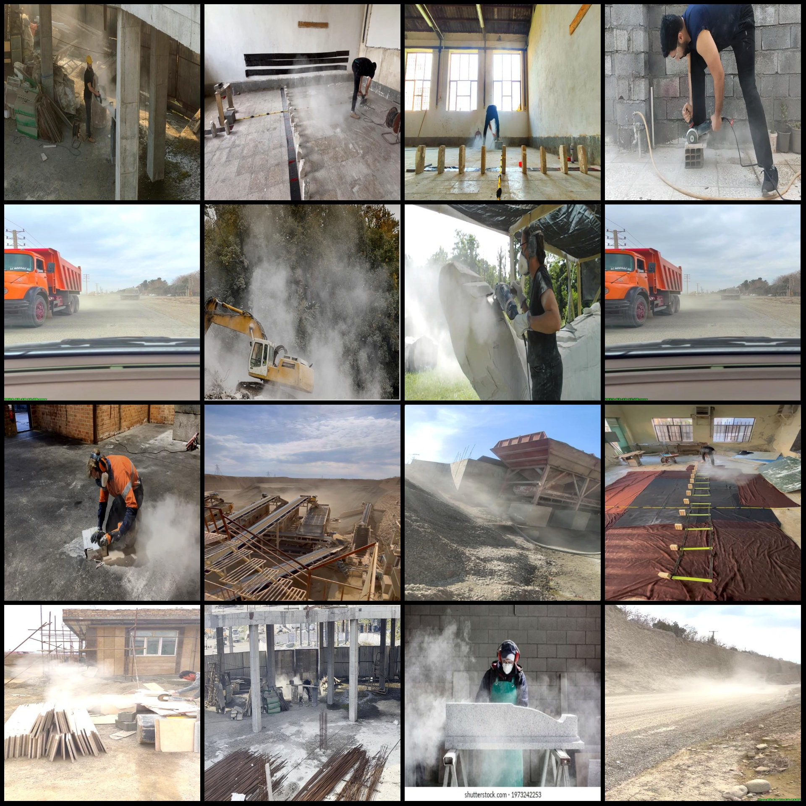
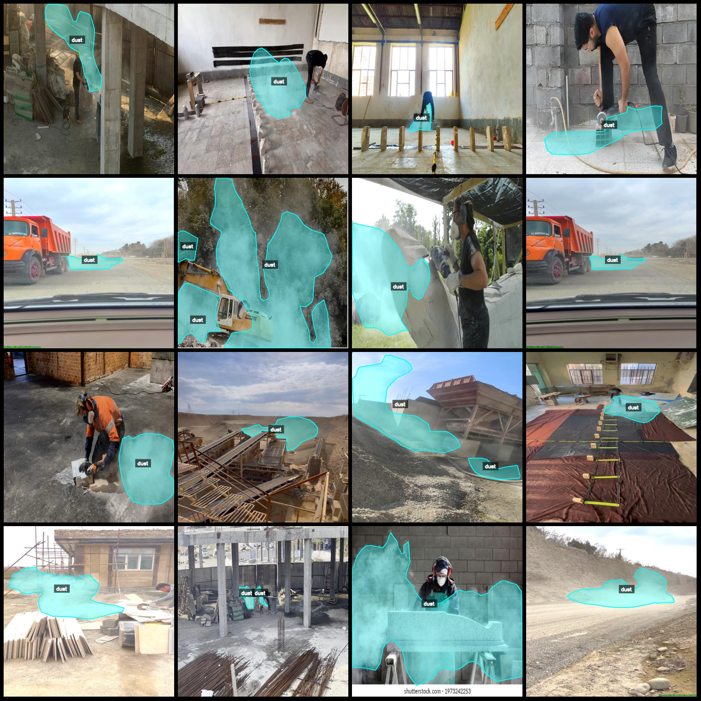
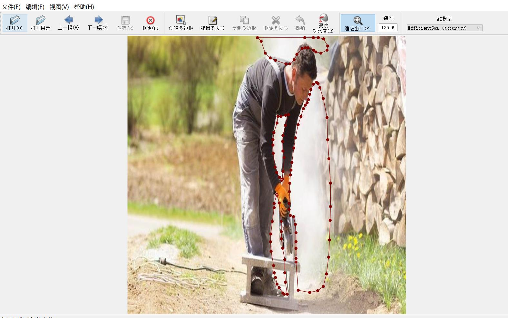

# Dust Identification and Segmentation Dataset

## Introduction
The dataset consists of 1188 images labeled with "dust" in the labelme format, which includes augmented images for a roughly equal proportion (about 1/3) of the original images. Images are enhanced 
by a factor of 1:2. The dataset is organized as follows:
- **Images** (JPG files): 1188
- **Annotations** (JSON files): 1188
- **Number of Annotations**: 1188
- **Number of Categories**: 1
- **Category Name**: "dust"
- **Number of Boxes per Category**: 1529
- **Total Boxes**: 1529

This dataset can be edited using the labelme tool version 5.5.0. The images have a resolution of 640x640 pixels. The annotation process involves drawing polygons around the category.

**Important Notes**: The dataset can be opened and edited using the labelme tool. However, the JSON dataset should be converted into either mask or YOLOF format for instance segmentation or semantic 
segmentation tasks.

**Disclaimer**: This dataset does not guarantee the accuracy of the trained models or weights files.

### Image Preview

#### Example of Annotation

#### Example of Labelme Editing Instance

---

Please note that this dataset is designed to be used for training models or weight files, but it does not guarantee the accuracy of the trained models or weights files.

## Images

Here is a pay link on Stripe ( https://buy.stripe.com/3cs8yP7sY87d0vu9AB ). Please contact me lonlonago@foxmail.com after funding $89, and I will send you a complete data files , thank you!

